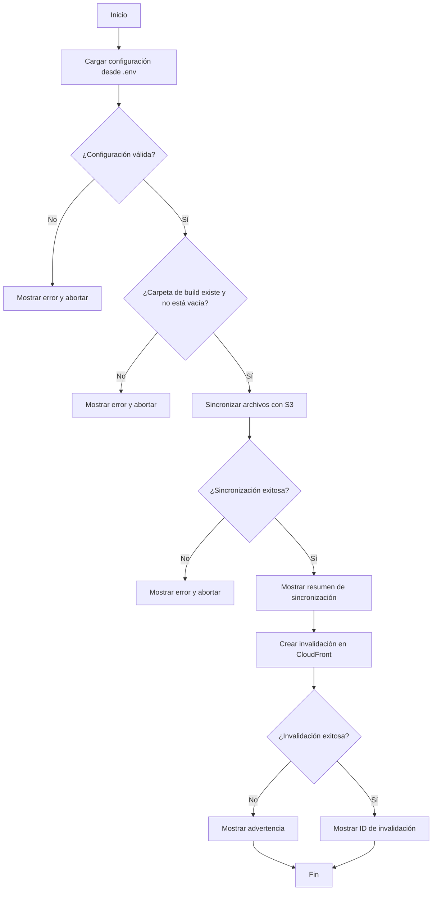

# Documento de Diseño: Pipeline de Despliegue AWS S3 + CloudFront

## Visión General

Este documento describe el diseño técnico del pipeline de despliegue que sincroniza archivos estáticos desde una carpeta de build local hacia un bucket S3 existente, y luego invalida la caché de una distribución CloudFront existente. El pipeline se implementará como un script Node.js ejecutable desde la línea de comandos, utilizando el AWS SDK v3 para las operaciones con S3 y CloudFront.

### Decisiones de Diseño

- **Lenguaje**: Node.js (JavaScript). Es ligero, ampliamente conocido y el AWS SDK v3 para JavaScript es modular (se importan solo los clientes necesarios).
- **AWS SDK v3**: Se usa `@aws-sdk/client-s3` y `@aws-sdk/client-cloudfront`. El SDK v3 es modular, lo que reduce el tamaño de las dependencias.
- **dotenv**: Se usa el paquete `dotenv` para cargar las variables de configuración desde el archivo `.env`.
- **Sin framework de build**: El script es independiente y se ejecuta directamente con `node`. No requiere compilación ni bundling.
- **Ejecución vía npm script**: Se define un script `deploy` en `package.json` para ejecutar el pipeline con `npm run deploy`.

## Arquitectura

El pipeline sigue una arquitectura secuencial simple con tres fases:



### Fases del Pipeline

1. **Fase de Configuración**: Carga y valida las variables del archivo `.env`.
2. **Fase de Sincronización**: Lee los archivos locales, los compara con el contenido del bucket S3, y ejecuta las operaciones necesarias (subir, actualizar, eliminar).
3. **Fase de Invalidación**: Crea una invalidación de caché en CloudFront para la ruta `/*`.

## Componentes e Interfaces

### Estructura de Archivos del Proyecto

```
proyecto/
├── .env                  # Variables de configuración (no se versiona)
├── .env.example          # Plantilla de variables requeridas
├── package.json          # Dependencias y script de despliegue
└── src/
    └── deploy.js         # Script principal del pipeline
```

### Módulo: `src/deploy.js`

Script principal que orquesta las tres fases del pipeline. Contiene las siguientes funciones:


#### `loadConfig()`
- **Responsabilidad**: Carga el archivo `.env` con `dotenv` y valida que las variables obligatorias estén presentes y no vacías.
- **Entrada**: Ninguna (lee del sistema de archivos).
- **Salida**: Objeto `{ bucketName, distributionId, buildDir }` o lanza un error descriptivo.
- **Variables requeridas**:
  - `S3_BUCKET_NAME`: Nombre del bucket S3.
  - `CLOUDFRONT_DISTRIBUTION_ID`: ID de la distribución CloudFront.
  - `BUILD_DIR`: Ruta relativa a la carpeta de build.

#### `validateBuildDir(buildDir)`
- **Responsabilidad**: Verifica que la carpeta de build exista y contenga al menos un archivo.
- **Entrada**: `buildDir` (string) — ruta a la carpeta de build.
- **Salida**: `true` si es válida, o lanza un error descriptivo.

#### `getLocalFiles(buildDir)`
- **Responsabilidad**: Recorre recursivamente la carpeta de build y retorna la lista de archivos con sus rutas relativas y hashes MD5.
- **Entrada**: `buildDir` (string).
- **Salida**: Array de objetos `{ key, filePath, md5 }`.

#### `getRemoteFiles(bucketName)`
- **Responsabilidad**: Lista todos los objetos en el bucket S3 y retorna sus claves y ETags.
- **Entrada**: `bucketName` (string).
- **Salida**: Array de objetos `{ key, etag }`.

#### `syncFiles(bucketName, localFiles, remoteFiles)`
- **Responsabilidad**: Compara archivos locales con remotos y ejecuta las operaciones necesarias:
  - Sube archivos nuevos (existen localmente pero no en S3).
  - Actualiza archivos modificados (el MD5 local difiere del ETag de S3).
  - Elimina archivos obsoletos (existen en S3 pero no localmente).
- **Entrada**: `bucketName` (string), `localFiles` (array), `remoteFiles` (array).
- **Salida**: Objeto `{ uploaded, updated, deleted }` con los conteos de cada operación.

#### `invalidateCache(distributionId)`
- **Responsabilidad**: Crea una invalidación en CloudFront para la ruta `/*`.
- **Entrada**: `distributionId` (string).
- **Salida**: `invalidationId` (string) o lanza un error.

#### `deploy()` (función principal)
- **Responsabilidad**: Orquesta la ejecución secuencial de todas las fases.
- **Flujo**:
  1. Llama a `loadConfig()`.
  2. Llama a `validateBuildDir(buildDir)`.
  3. Llama a `getLocalFiles(buildDir)` y `getRemoteFiles(bucketName)`.
  4. Llama a `syncFiles(bucketName, localFiles, remoteFiles)` y muestra el resumen.
  5. Llama a `invalidateCache(distributionId)` y muestra el ID. Si falla, muestra advertencia.

### Dependencias Externas

| Paquete | Versión | Propósito |
|---------|---------|-----------|
| `@aws-sdk/client-s3` | ^3.x | Operaciones con S3 (PutObject, DeleteObject, ListObjectsV2) |
| `@aws-sdk/client-cloudfront` | ^3.x | Crear invalidaciones en CloudFront |
| `dotenv` | ^16.x | Cargar variables desde `.env` |

> **Nota sobre credenciales AWS**: El SDK v3 resuelve las credenciales automáticamente a través de la cadena de proveedores por defecto (variables de entorno `AWS_ACCESS_KEY_ID` / `AWS_SECRET_ACCESS_KEY`, perfil de AWS CLI, etc.). No se gestionan credenciales dentro del script.

## Modelos de Datos

### Objeto de Configuración

```javascript
{
  bucketName: "mi-bucket-s3",           // string, requerido
  distributionId: "E1A2B3C4D5E6F7",    // string, requerido
  buildDir: "./dist"                     // string, requerido
}
```

### Archivo Local (LocalFile)

```javascript
{
  key: "assets/style.css",              // string — ruta relativa desde buildDir, usada como clave S3
  filePath: "/ruta/absoluta/dist/assets/style.css",  // string — ruta absoluta en disco
  md5: "d41d8cd98f00b204e9800998ecf8427e"            // string — hash MD5 del contenido
}
```

### Archivo Remoto (RemoteFile)

```javascript
{
  key: "assets/style.css",              // string — clave del objeto en S3
  etag: "\"d41d8cd98f00b204e9800998ecf8427e\""       // string — ETag del objeto (MD5 entre comillas)
}
```

### Resultado de Sincronización (SyncResult)

```javascript
{
  uploaded: 5,    // number — archivos nuevos subidos
  updated: 3,    // number — archivos existentes actualizados
  deleted: 2     // number — archivos obsoletos eliminados
}
```


## Propiedades de Correctitud

*Una propiedad es una característica o comportamiento que debe cumplirse en todas las ejecuciones válidas de un sistema — esencialmente, una declaración formal sobre lo que el sistema debe hacer. Las propiedades sirven como puente entre especificaciones legibles por humanos y garantías de correctitud verificables por máquinas.*

### Propiedad 1: Clasificación correcta de archivos en la sincronización

*Para cualquier* conjunto de archivos locales y cualquier conjunto de archivos remotos, la función de sincronización debe clasificar correctamente cada archivo como: nuevo (existe localmente pero no en S3), actualizado (existe en ambos pero el MD5 difiere del ETag), eliminado (existe en S3 pero no localmente), o sin cambios (existe en ambos con el mismo hash). La unión de archivos nuevos, actualizados y sin cambios debe ser igual al conjunto de archivos locales, y la unión de archivos actualizados, eliminados y sin cambios debe ser igual al conjunto de archivos remotos.

**Valida: Requisitos 1.1, 1.2**

### Propiedad 2: Precisión del resumen de sincronización

*Para cualquier* resultado de sincronización con conteos de archivos subidos, actualizados y eliminados, el resumen generado debe contener exactamente esos tres números y ser parseable para recuperar los valores originales.

**Valida: Requisito 1.3**

### Propiedad 3: Round trip de configuración

*Para cualquier* conjunto de valores válidos (bucketName no vacío, distributionId no vacío, buildDir no vacío), si se escriben en formato `.env` y luego se leen con `loadConfig`, los valores recuperados deben ser idénticos a los originales.

**Valida: Requisito 4.1**

### Propiedad 4: Detección de variables faltantes o vacías

*Para cualquier* subconjunto de las variables obligatorias (`S3_BUCKET_NAME`, `CLOUDFRONT_DISTRIBUTION_ID`, `BUILD_DIR`) que esté ausente o vacío en el archivo `.env`, `loadConfig` debe lanzar un error que mencione el nombre de la primera variable faltante o vacía.

**Valida: Requisito 4.4**

## Manejo de Errores

El pipeline implementa una estrategia de "fail fast" donde los errores en fases tempranas detienen la ejecución antes de ejecutar fases posteriores.

### Tabla de Errores

| Fase | Condición de Error | Comportamiento | Requisito |
|------|-------------------|----------------|-----------|
| Configuración | Archivo `.env` no encontrado | Mostrar error, abortar | 4.3 |
| Configuración | Variable obligatoria faltante o vacía | Mostrar error con nombre de variable, abortar | 4.4 |
| Configuración | Credenciales AWS inválidas o ausentes | Mostrar error de autenticación, abortar | 3.2 |
| Validación | Carpeta de build no existe | Mostrar error, abortar sin modificar S3 | 1.4 |
| Validación | Carpeta de build vacía | Mostrar error, abortar sin modificar S3 | 1.4 |
| Sincronización | Bucket S3 no existe o inaccesible | Mostrar error, abortar sin invalidar caché | 3.3 |
| Sincronización | Fallo en operación S3 | Mostrar error descriptivo, abortar sin invalidar caché | 3.1 |
| Invalidación | Fallo al crear invalidación | Mostrar advertencia (no error fatal), los archivos ya se subieron | 2.2 |

### Estrategia de Mensajes

- Los errores fatales se muestran con prefijo `❌ Error:` y terminan el proceso con código de salida 1.
- Las advertencias se muestran con prefijo `⚠️ Advertencia:` y el proceso termina con código de salida 0.
- Los mensajes de éxito se muestran con prefijo `✅`.

## Estrategia de Testing

### Enfoque Dual

Se utilizan dos tipos de tests complementarios:

1. **Tests unitarios**: Verifican ejemplos específicos, casos borde y condiciones de error.
2. **Tests de propiedades (property-based)**: Verifican propiedades universales con entradas generadas aleatoriamente.

### Librería de Property-Based Testing

Se utilizará **fast-check** (`fast-check` npm package), la librería de property-based testing más madura para JavaScript/Node.js.

### Configuración de Tests de Propiedades

- Cada test de propiedad debe ejecutar un mínimo de **100 iteraciones**.
- Cada test debe incluir un comentario que referencia la propiedad del documento de diseño.
- Formato del tag: **Feature: aws-s3-cloudfront-project, Property {número}: {texto de la propiedad}**

### Tests de Propiedades (basados en las Propiedades de Correctitud)

| Test | Propiedad | Descripción |
|------|-----------|-------------|
| P1 | Propiedad 1 | Generar conjuntos aleatorios de archivos locales y remotos, ejecutar la lógica de clasificación, verificar que cada archivo se clasifica correctamente. |
| P2 | Propiedad 2 | Generar conteos aleatorios (uploaded, updated, deleted), generar el resumen, verificar que los números en el texto coinciden con los originales. |
| P3 | Propiedad 3 | Generar valores aleatorios de configuración válidos, escribirlos en formato `.env`, leerlos con `loadConfig`, verificar igualdad. |
| P4 | Propiedad 4 | Generar combinaciones aleatorias de variables presentes/ausentes/vacías, ejecutar `loadConfig`, verificar que el error menciona la variable correcta. |

### Tests Unitarios

| Test | Requisito | Descripción |
|------|-----------|-------------|
| U1 | 1.4 | Verificar que `validateBuildDir` lanza error cuando la carpeta no existe. |
| U2 | 1.4 | Verificar que `validateBuildDir` lanza error cuando la carpeta está vacía. |
| U3 | 2.1 | Verificar que `invalidateCache` envía la ruta `/*` a CloudFront. |
| U4 | 2.2 | Verificar que cuando la invalidación falla, se muestra advertencia y no se lanza error fatal. |
| U5 | 2.3 | Verificar que cuando la invalidación tiene éxito, se muestra el ID de invalidación. |
| U6 | 3.1 | Verificar que si la sincronización falla, no se ejecuta la invalidación. |
| U7 | 3.2 | Verificar que errores de credenciales AWS se capturan y muestran mensaje apropiado. |
| U8 | 3.3 | Verificar que un bucket inexistente produce un mensaje de error descriptivo. |
| U9 | 4.2 | Verificar que `.env.example` contiene las tres variables requeridas sin valores. |
| U10 | 4.3 | Verificar que `loadConfig` lanza error cuando `.env` no existe. |

### Framework de Testing

- **Vitest** como test runner (rápido, compatible con ESM, sin configuración compleja).
- **fast-check** para property-based testing.
- Los tests se ubican en `src/__tests__/deploy.test.js`.
- Las funciones de AWS SDK se mockean para aislar la lógica del pipeline.
