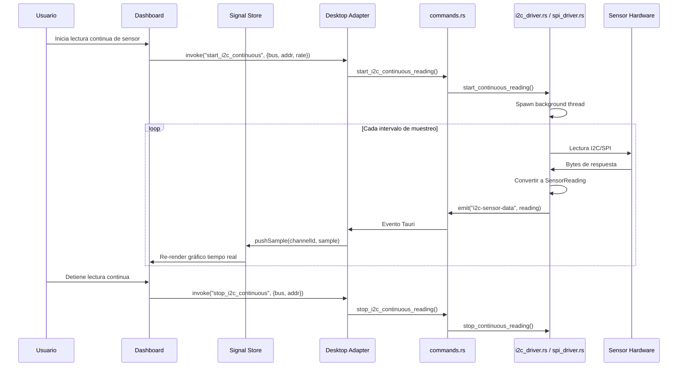

# Documento de Diseño: Soporte de Buses I2C y SPI

## Visión General

Este documento describe el diseño técnico para extender la aplicación Tauri de control de hardware con soporte para buses I2C y SPI. La extensión añade dos módulos Rust (`i2c_driver.rs` y `spi_driver.rs`) que utilizan las crates `i2cdev` y `spidev` respectivamente para comunicarse con dispositivos en plataformas Linux embebidas (Raspberry Pi, BeagleBone, etc.). Los nuevos módulos se exponen al frontend mediante comandos Tauri adicionales en `commands.rs`, y los datos de sensores se integran con el `signal-store` existente para visualización en tiempo real.

### Decisiones de Diseño

- **Crates de hardware**: `i2cdev` para I2C y `spidev` para SPI — ambas son las crates estándar del ecosistema Rust para acceso a buses Linux (`/dev/i2c-*` y `/dev/spidev*`).
- **Patrón de módulos**: Se sigue el mismo patrón que `serial_port.rs` y `adc_driver.rs` — estado compartido con `Arc<Mutex<>>`, tipos de error serializables con Serde, y funciones públicas que operan sobre el estado compartido.
- **Comandos Tauri**: Se extiende `commands.rs` con nuevos `#[tauri::command]` para I2C y SPI, siguiendo la misma convención de retornar `Result<T, String>`.
- **Lecturas continuas**: Se implementan con hilos de fondo (`std::thread::spawn`) que emiten eventos Tauri (`i2c-sensor-data`, `spi-sensor-data`, `i2c-error`, `spi-error`), siguiendo el patrón del reader thread de `connect_port`.
- **Integración frontend**: Los eventos Tauri se consumen desde el `DesktopAdapter` extendido (o un nuevo `BusAdapter`) y se insertan en el `signal-store` existente como canales adicionales.
- **Tipos TypeScript**: Se añaden interfaces para configuraciones I2C/SPI y resultados de operaciones en `src/communication/types.ts`.
- **Serialización**: Las configuraciones I2C/SPI se serializan como JSON (via Serde en Rust y tipos TypeScript en frontend), no como protocolo binario custom. Esto simplifica la comunicación interna Tauri.
- **Validación**: Se extiende `src/utils/validation.ts` con funciones de validación para frecuencias de muestreo I2C (1–1000 Hz) y SPI (1–10000 Hz), y velocidades de reloj.

## Arquitectura

La extensión se integra en la arquitectura existente añadiendo dos módulos Rust paralelos al `serial_port.rs` y `adc_driver.rs`:

```mermaid
flowchart TD
    subgraph Frontend["Frontend (React + TypeScript)"]
        UI[Dashboard / UI Components]
        Charts[Gráficos Tiempo Real - uPlot]
        SignalStore[Signal Store - Zustand]
        BusTypes[Tipos I2C/SPI - TypeScript]
    end

    subgraph CommLayer["Capa de Comunicación"]
        DesktopAdapter[Desktop Adapter - Tauri invoke/listen]
    end

    subgraph Backend["Backend Rust (Tauri)"]
        Commands[commands.rs - Tauri Commands]
        SerialPort[serial_port.rs]
        ADC[adc_driver.rs]
        I2C[i2c_driver.rs - NUEVO]
        SPI[spi_driver.rs - NUEVO]
    end

    subgraph Hardware["Hardware Linux"]
        I2CBus[/dev/i2c-*]
        SPIBus[/dev/spidev*]
        SerialBus[/dev/ttyUSB*]
    end

    UI --> SignalStore
    Charts --> SignalStore
    SignalStore --> DesktopAdapter
    BusTypes --> DesktopAdapter
    DesktopAdapter --> Commands
    Commands --> SerialPort
    Commands --> ADC
    Commands --> I2C
    Commands --> SPI
    SerialPort --> SerialBus
    I2C --> I2CBus
    SPI --> SPIBus
```

### Flujo de Datos — Lectura Continua de Sensor I2C/SPI



## Componentes e Interfaces

### Estructura de Archivos Nuevos/Modificados

```
src-tauri/src/
├── i2c_driver.rs          # NUEVO — Driver I2C con i2cdev
├── spi_driver.rs          # NUEVO — Driver SPI con spidev
├── commands.rs            # MODIFICADO — Nuevos comandos Tauri
├── main.rs                # MODIFICADO — Registrar nuevos módulos y comandos
└── Cargo.toml             # MODIFICADO — Añadir dependencias i2cdev, spidev

src/communication/
├── types.ts               # MODIFICADO — Tipos I2C/SPI
├── desktop-adapter.ts     # MODIFICADO — Listeners para eventos I2C/SPI

src/utils/
├── validation.ts          # MODIFICADO — Validación de parámetros I2C/SPI

src/store/
├── signal-store.ts        # SIN CAMBIOS — Se reutiliza tal cual
```


### Módulo Rust: `i2c_driver.rs`

```rust
// src-tauri/src/i2c_driver.rs

use i2cdev::core::I2CDevice;
use i2cdev::linux::LinuxI2CDevice;
use serde::{Deserialize, Serialize};
use std::fs;
use std::sync::{Arc, Mutex};
use std::time::{SystemTime, UNIX_EPOCH};

/// Información de un bus I2C disponible en el sistema.
#[derive(Debug, Clone, Serialize, Deserialize)]
pub struct I2cBusInfo {
    pub bus_number: u8,
    pub path: String,
    pub accessible: bool,
    pub error_message: Option<String>,
}

/// Configuración del bus I2C.
#[derive(Debug, Clone, Serialize, Deserialize, PartialEq)]
pub struct I2cConfig {
    pub bus_number: u8,
    pub clock_speed_khz: u32,       // 100, 400, o 1000
    pub address_mode: I2cAddressMode,
}

#[derive(Debug, Clone, Serialize, Deserialize, PartialEq)]
pub enum I2cAddressMode {
    SevenBit,
    TenBit,
}

/// Lectura de un sensor I2C.
#[derive(Debug, Clone, Serialize, Deserialize)]
pub struct I2cSensorReading {
    pub bus_number: u8,
    pub address: u16,
    pub data: Vec<u8>,
    pub timestamp: u64,
}

/// Error de operaciones I2C.
#[derive(Debug, Clone, Serialize, Deserialize)]
pub struct I2cError {
    pub code: String,
    pub message: String,
}

/// Estado compartido del driver I2C.
pub type SharedI2c = Arc<Mutex<I2cState>>;

pub struct I2cState {
    pub configs: std::collections::HashMap<u8, I2cConfig>,
    pub continuous_readers: std::collections::HashMap<(u8, u16), bool>, // (bus, addr) -> active
}

// Funciones públicas:
// - list_i2c_buses() -> Result<Vec<I2cBusInfo>, I2cError>
// - scan_i2c_bus(bus: u8) -> Result<Vec<u16>, I2cError>
// - configure_i2c(shared: &SharedI2c, config: I2cConfig) -> Result<(), I2cError>
// - i2c_read(bus: u8, address: u16, length: usize) -> Result<Vec<u8>, I2cError>
// - i2c_write(bus: u8, address: u16, data: &[u8]) -> Result<(), I2cError>
// - i2c_write_read(bus: u8, address: u16, write_data: &[u8], read_length: usize) -> Result<Vec<u8>, I2cError>
// - start_continuous_reading(shared: &SharedI2c, bus: u8, address: u16, read_length: usize, sample_rate_hz: u32, app_handle: AppHandle) -> Result<(), I2cError>
// - stop_continuous_reading(shared: &SharedI2c, bus: u8, address: u16) -> Result<(), I2cError>
```

### Módulo Rust: `spi_driver.rs`

```rust
// src-tauri/src/spi_driver.rs

use spidev::{Spidev, SpidevOptions, SpiModeFlags, SpidevTransfer};
use serde::{Deserialize, Serialize};
use std::fs;
use std::sync::{Arc, Mutex};
use std::time::{SystemTime, UNIX_EPOCH};

/// Información de un bus SPI disponible en el sistema.
#[derive(Debug, Clone, Serialize, Deserialize)]
pub struct SpiBusInfo {
    pub bus_number: u8,
    pub chip_select: u8,
    pub path: String,
    pub accessible: bool,
    pub error_message: Option<String>,
}

/// Configuración del bus SPI.
#[derive(Debug, Clone, Serialize, Deserialize, PartialEq)]
pub struct SpiConfig {
    pub bus_number: u8,
    pub chip_select: u8,
    pub clock_speed_hz: u32,        // 100_000 a 50_000_000
    pub mode: SpiMode,              // Modo 0, 1, 2 o 3
    pub bits_per_word: u8,          // Típicamente 8
    pub bit_order: SpiBitOrder,     // MSB o LSB first
}

#[derive(Debug, Clone, Serialize, Deserialize, PartialEq)]
pub enum SpiMode {
    Mode0, // CPOL=0, CPHA=0
    Mode1, // CPOL=0, CPHA=1
    Mode2, // CPOL=1, CPHA=0
    Mode3, // CPOL=1, CPHA=1
}

#[derive(Debug, Clone, Serialize, Deserialize, PartialEq)]
pub enum SpiBitOrder {
    MsbFirst,
    LsbFirst,
}

/// Resultado de una transferencia SPI.
#[derive(Debug, Clone, Serialize, Deserialize)]
pub struct SpiTransferResult {
    pub tx_data: Vec<u8>,
    pub rx_data: Vec<u8>,
    pub timestamp: u64,
}

/// Error de operaciones SPI.
#[derive(Debug, Clone, Serialize, Deserialize)]
pub struct SpiError {
    pub code: String,
    pub message: String,
}

/// Estado compartido del driver SPI.
pub type SharedSpi = Arc<Mutex<SpiState>>;

pub struct SpiState {
    pub configs: std::collections::HashMap<(u8, u8), SpiConfig>,
    pub continuous_readers: std::collections::HashMap<(u8, u8), bool>, // (bus, cs) -> active
}

// Funciones públicas:
// - list_spi_buses() -> Result<Vec<SpiBusInfo>, SpiError>
// - configure_spi(shared: &SharedSpi, config: SpiConfig) -> Result<(), SpiError>
// - spi_transfer(bus: u8, cs: u8, tx_data: &[u8]) -> Result<Vec<u8>, SpiError>
// - spi_write(bus: u8, cs: u8, data: &[u8]) -> Result<(), SpiError>
// - spi_read(bus: u8, cs: u8, length: usize) -> Result<Vec<u8>, SpiError>
// - start_continuous_reading(shared: &SharedSpi, bus: u8, cs: u8, tx_data: &[u8], sample_rate_hz: u32, app_handle: AppHandle) -> Result<(), SpiError>
// - stop_continuous_reading(shared: &SharedSpi, bus: u8, cs: u8) -> Result<(), SpiError>
```

### Comandos Tauri Nuevos (extensión de `commands.rs`)

```rust
// Nuevos comandos a añadir en src-tauri/src/commands.rs

// --- I2C ---
#[tauri::command]
pub fn list_i2c_buses() -> Result<Vec<I2cBusInfo>, String>;

#[tauri::command]
pub fn scan_i2c(bus_number: u8) -> Result<Vec<u16>, String>;

#[tauri::command]
pub fn configure_i2c(config: I2cConfig, shared: State<SharedI2c>) -> Result<(), String>;

#[tauri::command]
pub fn i2c_read(bus_number: u8, address: u16, length: usize) -> Result<Vec<u8>, String>;

#[tauri::command]
pub fn i2c_write(bus_number: u8, address: u16, data: Vec<u8>) -> Result<(), String>;

#[tauri::command]
pub fn i2c_write_read(bus_number: u8, address: u16, write_data: Vec<u8>, read_length: usize) -> Result<Vec<u8>, String>;

#[tauri::command]
pub fn start_i2c_continuous(bus_number: u8, address: u16, read_length: usize, sample_rate_hz: u32, shared: State<SharedI2c>, app: AppHandle) -> Result<(), String>;

#[tauri::command]
pub fn stop_i2c_continuous(bus_number: u8, address: u16, shared: State<SharedI2c>) -> Result<(), String>;

// --- SPI ---
#[tauri::command]
pub fn list_spi_buses() -> Result<Vec<SpiBusInfo>, String>;

#[tauri::command]
pub fn configure_spi(config: SpiConfig, shared: State<SharedSpi>) -> Result<(), String>;

#[tauri::command]
pub fn spi_transfer(bus_number: u8, chip_select: u8, tx_data: Vec<u8>) -> Result<Vec<u8>, String>;

#[tauri::command]
pub fn spi_write(bus_number: u8, chip_select: u8, data: Vec<u8>) -> Result<(), String>;

#[tauri::command]
pub fn spi_read(bus_number: u8, chip_select: u8, length: usize) -> Result<Vec<u8>, String>;

#[tauri::command]
pub fn start_spi_continuous(bus_number: u8, chip_select: u8, tx_data: Vec<u8>, sample_rate_hz: u32, shared: State<SharedSpi>, app: AppHandle) -> Result<(), String>;

#[tauri::command]
pub fn stop_spi_continuous(bus_number: u8, chip_select: u8, shared: State<SharedSpi>) -> Result<(), String>;
```

### Tipos TypeScript (extensión de `types.ts`)

```typescript
// Nuevos tipos a añadir en src/communication/types.ts

// --- I2C ---
export interface I2cBusInfo {
  busNumber: number;
  path: string;
  accessible: boolean;
  errorMessage?: string;
}

export type I2cAddressMode = 'SevenBit' | 'TenBit';

export interface I2cConfig {
  busNumber: number;
  clockSpeedKhz: number;       // 100, 400, 1000
  addressMode: I2cAddressMode;
}

export interface I2cSensorReading {
  busNumber: number;
  address: number;
  data: number[];
  timestamp: number;
}

// --- SPI ---
export interface SpiBusInfo {
  busNumber: number;
  chipSelect: number;
  path: string;
  accessible: boolean;
  errorMessage?: string;
}

export type SpiMode = 'Mode0' | 'Mode1' | 'Mode2' | 'Mode3';
export type SpiBitOrder = 'MsbFirst' | 'LsbFirst';

export interface SpiConfig {
  busNumber: number;
  chipSelect: number;
  clockSpeedHz: number;         // 100_000 a 50_000_000
  mode: SpiMode;
  bitsPerWord: number;
  bitOrder: SpiBitOrder;
}

export interface SpiTransferResult {
  txData: number[];
  rxData: number[];
  timestamp: number;
}
```

### Extensión de Validación (`validation.ts`)

```typescript
// Nuevas funciones a añadir en src/utils/validation.ts

/** Velocidades de reloj I2C válidas en kHz */
export const VALID_I2C_CLOCK_SPEEDS = [100, 400, 1000] as const;

/** Valida velocidad de reloj I2C. Retorna true si es 100, 400 o 1000 kHz. */
export function validateI2cClockSpeed(speedKhz: number): boolean {
  return VALID_I2C_CLOCK_SPEEDS.includes(speedKhz as 100 | 400 | 1000);
}

/** Valida velocidad de reloj SPI. Rango válido: 100 kHz a 50 MHz. */
export function validateSpiClockSpeed(speedHz: number): boolean {
  return speedHz >= 100_000 && speedHz <= 50_000_000;
}

/** Valida frecuencia de muestreo I2C. Rango válido: 1–1000 Hz. */
export function validateI2cSampleRate(rate: number): boolean {
  return rate >= 1 && rate <= 1000;
}

/** Valida frecuencia de muestreo SPI. Rango válido: 1–10000 Hz. */
export function validateSpiSampleRate(rate: number): boolean {
  return rate >= 1 && rate <= 10000;
}

/** Valida dirección I2C en modo 7 bits. Rango válido: 0x03–0x77. */
export function validateI2cAddress7Bit(address: number): boolean {
  return Number.isInteger(address) && address >= 0x03 && address <= 0x77;
}

/** Valida modo SPI. Valores válidos: 0, 1, 2, 3. */
export function validateSpiMode(mode: number): boolean {
  return mode >= 0 && mode <= 3 && Number.isInteger(mode);
}
```

### Integración con Signal Store

El `signal-store.ts` existente no requiere cambios. Los datos de sensores I2C/SPI se integran creando canales con IDs descriptivos:

```typescript
// Ejemplo de integración desde el frontend al recibir evento i2c-sensor-data
import { useSignalStore } from '../store/signal-store';

// Al recibir evento Tauri 'i2c-sensor-data':
function handleI2cSensorData(reading: I2cSensorReading) {
  const store = useSignalStore.getState();
  const channelId = `i2c-${reading.busNumber}-0x${reading.address.toString(16)}`;

  // Crear canal si no existe
  store.addChannel({
    id: channelId,
    name: `I2C Bus ${reading.busNumber} @ 0x${reading.address.toString(16)}`,
    unit: '°C', // Configurable según tipo de sensor
    sampleRateHz: 10,
    samples: [],
  });

  // Insertar muestra (conversión de datos crudos a valor según tipo de sensor)
  store.pushSample(channelId, {
    timestamp: reading.timestamp,
    value: convertRawToValue(reading.data, 'temperature'), // función de conversión
  });
}
```

### Pretty-Print de Configuraciones I2C/SPI

```typescript
// Funciones de formateo para el panel de log

export function prettyPrintI2cConfig(config: I2cConfig): string {
  return `[I2C] bus: ${config.busNumber}, clock: ${config.clockSpeedKhz} kHz, addr_mode: ${config.addressMode}`;
}

export function prettyPrintSpiConfig(config: SpiConfig): string {
  return `[SPI] bus: ${config.busNumber}, cs: ${config.chipSelect}, clock: ${config.clockSpeedHz} Hz, mode: ${config.mode}, bit_order: ${config.bitOrder}`;
}
```


## Modelos de Datos

### Información de Bus I2C (`I2cBusInfo`)

```typescript
{
  busNumber: number;          // Número de bus (e.g. 1 para /dev/i2c-1)
  path: string;               // Ruta del dispositivo (e.g. "/dev/i2c-1")
  accessible: boolean;        // Si el usuario tiene permisos de lectura/escritura
  errorMessage?: string;      // Mensaje de error si no es accesible
}
```

### Configuración I2C (`I2cConfig`)

```typescript
{
  busNumber: number;           // Número de bus
  clockSpeedKhz: number;      // 100, 400 o 1000 kHz
  addressMode: I2cAddressMode; // 'SevenBit' | 'TenBit'
}
```

### Información de Bus SPI (`SpiBusInfo`)

```typescript
{
  busNumber: number;           // Número de bus (e.g. 0 para /dev/spidev0.0)
  chipSelect: number;          // Número de chip select (e.g. 0 para /dev/spidev0.0)
  path: string;                // Ruta del dispositivo (e.g. "/dev/spidev0.0")
  accessible: boolean;         // Si el usuario tiene permisos
  errorMessage?: string;       // Mensaje de error si no es accesible
}
```

### Configuración SPI (`SpiConfig`)

```typescript
{
  busNumber: number;           // Número de bus
  chipSelect: number;          // Número de chip select
  clockSpeedHz: number;        // 100_000 a 50_000_000 Hz
  mode: SpiMode;               // 'Mode0' | 'Mode1' | 'Mode2' | 'Mode3'
  bitsPerWord: number;         // Típicamente 8
  bitOrder: SpiBitOrder;       // 'MsbFirst' | 'LsbFirst'
}
```

### Lectura de Sensor I2C (`I2cSensorReading`)

```typescript
{
  busNumber: number;           // Bus de origen
  address: number;             // Dirección del dispositivo (7 o 10 bits)
  data: number[];              // Bytes leídos del sensor
  timestamp: number;           // Timestamp en milisegundos desde UNIX epoch
}
```

### Resultado de Transferencia SPI (`SpiTransferResult`)

```typescript
{
  txData: number[];            // Bytes enviados
  rxData: number[];            // Bytes recibidos (full-duplex)
  timestamp: number;           // Timestamp en milisegundos desde UNIX epoch
}
```

### Mapeo SPI Mode → CPOL/CPHA

| Modo | CPOL | CPHA | Descripción |
|------|------|------|-------------|
| Mode0 | 0 | 0 | Reloj inactivo bajo, datos muestreados en flanco ascendente |
| Mode1 | 0 | 1 | Reloj inactivo bajo, datos muestreados en flanco descendente |
| Mode2 | 1 | 0 | Reloj inactivo alto, datos muestreados en flanco descendente |
| Mode3 | 1 | 1 | Reloj inactivo alto, datos muestreados en flanco ascendente |

### Eventos Tauri Nuevos

| Evento | Payload | Descripción |
|--------|---------|-------------|
| `i2c-sensor-data` | `I2cSensorReading` | Lectura continua de sensor I2C |
| `spi-sensor-data` | `SpiTransferResult` | Lectura continua de sensor SPI |
| `i2c-error` | `string` | Error en operación I2C |
| `spi-error` | `string` | Error en operación SPI |
| `i2c-continuous-stopped` | `{ bus: u8, address: u16, reason: string }` | Lectura continua detenida (por error o usuario) |
| `spi-continuous-stopped` | `{ bus: u8, cs: u8, reason: string }` | Lectura continua detenida (por error o usuario) |


## Propiedades de Correctitud

*Una propiedad es una característica o comportamiento que debe cumplirse en todas las ejecuciones válidas de un sistema — esencialmente, una declaración formal sobre lo que el sistema debe hacer. Las propiedades sirven como puente entre especificaciones legibles por humanos y garantías de correctitud verificables por máquinas.*

### Propiedad 1: Parsing de rutas de bus I2C y SPI

*Para cualquier* conjunto de entradas de directorio que coincidan con el patrón `/dev/i2c-N`, la función de enumeración I2C debe retornar un `I2cBusInfo` por cada entrada con el `busNumber` correcto extraído del sufijo numérico y la `path` completa. Análogamente, *para cualquier* conjunto de entradas `/dev/spidevB.C`, la función de enumeración SPI debe retornar un `SpiBusInfo` con `busNumber` B y `chipSelect` C correctamente extraídos.

**Valida: Requisitos 1.1, 1.2**

### Propiedad 2: Escaneo I2C retorna direcciones en rango válido

*Para cualquier* resultado de escaneo I2C en modo 7 bits, todas las direcciones retornadas deben estar en el rango inclusivo [0x03, 0x77]. No debe retornarse ninguna dirección fuera de este rango.

**Valida: Requisito 2.1**

### Propiedad 3: Formateo hexadecimal de direcciones I2C

*Para cualquier* dirección I2C válida (número entero en [0x03, 0x77]), la función de formateo debe producir un string que contenga la representación hexadecimal de la dirección con prefijo "0x" y exactamente 2 dígitos hexadecimales.

**Valida: Requisito 2.2**

### Propiedad 4: Validación de velocidad de reloj I2C

*Para cualquier* valor entero, `validateI2cClockSpeed(value)` debe retornar `true` si y solo si el valor es 100, 400 o 1000. Cualquier otro valor debe ser rechazado.

**Valida: Requisitos 3.1, 3.3**

### Propiedad 5: Validación de velocidad de reloj SPI

*Para cualquier* valor numérico, `validateSpiClockSpeed(value)` debe retornar `true` si y solo si el valor está en el rango [100_000, 50_000_000]. Valores fuera de este rango deben ser rechazados.

**Valida: Requisitos 4.1, 4.4**

### Propiedad 6: Validación de frecuencia de muestreo I2C y SPI

*Para cualquier* valor numérico, `validateI2cSampleRate(value)` debe retornar `true` si y solo si el valor está en [1, 1000], y `validateSpiSampleRate(value)` debe retornar `true` si y solo si el valor está en [1, 10000].

**Valida: Requisito 7.2**

### Propiedad 7: Lectura SPI genera buffer TX de ceros

*Para cualquier* longitud de lectura N ≥ 1, la función `spi_read` debe generar un buffer de transmisión de exactamente N bytes, todos con valor 0x00, para enviar al dispositivo SPI durante la lectura full-duplex.

**Valida: Requisito 6.3**

### Propiedad 8: Round-trip de serialización JSON de configuración I2C

*Para cualquier* `I2cConfig` válida (con `clockSpeedKhz` en {100, 400, 1000} y `addressMode` en {SevenBit, TenBit}), serializar a JSON y luego deserializar debe producir una estructura equivalente a la original.

**Valida: Requisitos 9.1, 9.2, 9.4**

### Propiedad 9: Round-trip de serialización JSON de configuración SPI

*Para cualquier* `SpiConfig` válida (con `clockSpeedHz` en [100_000, 50_000_000], `mode` en {Mode0, Mode1, Mode2, Mode3}, `bitOrder` en {MsbFirst, LsbFirst} y `bitsPerWord` > 0), serializar a JSON y luego deserializar debe producir una estructura equivalente a la original.

**Valida: Requisitos 9.1, 9.2, 9.5**

### Propiedad 10: Pretty-print de configuraciones contiene todos los campos

*Para cualquier* `I2cConfig` válida, `prettyPrintI2cConfig(config)` debe retornar un string que contenga el número de bus, la velocidad de reloj y el modo de direccionamiento. Análogamente, *para cualquier* `SpiConfig` válida, `prettyPrintSpiConfig(config)` debe retornar un string que contenga el número de bus, chip select, velocidad de reloj, modo SPI y orden de bits.

**Valida: Requisitos 9.3, 10.4**

### Propiedad 11: Errores de bus contienen código y mensaje descriptivo

*Para cualquier* error generado por el Driver_I2C o Driver_SPI, el objeto de error debe contener un campo `code` no vacío y un campo `message` no vacío. El mensaje debe contener información relevante del contexto (número de bus, dirección o chip select según corresponda).

**Valida: Requisitos 10.1, 10.4**

### Propiedad 12: Integración de lectura de sensor con signal store

*Para cualquier* `I2cSensorReading` o `SpiTransferResult` con datos válidos, al procesarla e insertarla en el signal store, el canal correspondiente debe existir con un ID que siga el patrón `i2c-{bus}-0x{addr}` o `spi-{bus}-{cs}`, y la última muestra del canal debe tener el timestamp y valor de la lectura procesada.

**Valida: Requisitos 8.1, 8.2**

### Propiedad 13: Conversión de datos crudos de sensor

*Para cualquier* array de bytes crudos de un sensor de temperatura (2 bytes, formato big-endian con factor de escala conocido), la función de conversión debe producir un valor en °C dentro del rango físicamente plausible [-40, 125]. La conversión debe ser determinista: los mismos bytes de entrada siempre producen el mismo valor de salida.

**Valida: Requisito 8.3**


## Manejo de Errores

La extensión I2C/SPI sigue la misma estrategia de manejo de errores por capas de la aplicación existente, con tipos de error serializables que se propagan desde los drivers Rust hasta el frontend.

### Tabla de Errores

| Capa | Condición de Error | Comportamiento | Requisito |
|------|-------------------|----------------|-----------|
| Enumeración | Bus I2C/SPI no encontrado en `/dev/` | Retornar lista vacía, sin error | 1.1, 1.2 |
| Enumeración | Bus sin permisos de lectura/escritura | Marcar `accessible: false` con mensaje descriptivo | 1.3 |
| Escaneo I2C | Bus especificado no existe | Error con código `BUS_NOT_FOUND` y mensaje descriptivo | 2.3 |
| Escaneo I2C | Permisos insuficientes en el bus | Error con código `PERMISSION_DENIED` y mensaje descriptivo | 2.3 |
| Configuración | Velocidad de reloj I2C fuera de {100, 400, 1000} kHz | Error con código `INVALID_CLOCK_SPEED` y velocidades válidas | 3.3 |
| Configuración | Velocidad de reloj SPI fuera de [100 kHz, 50 MHz] | Error con código `INVALID_CLOCK_SPEED` y rango válido | 4.4 |
| Configuración | Modo SPI inválido | Error con código `INVALID_SPI_MODE` y modos válidos | 4.2 |
| Transacción I2C | Dispositivo no responde (NACK) | Error con código `DEVICE_NACK` y dirección del dispositivo | 10.2 |
| Transacción I2C | Timeout de 1 segundo | Error con código `TIMEOUT` y dirección del dispositivo | 5.4 |
| Transacción SPI | Error de bus durante transferencia | Error con código `BUS_ERROR` y descripción de la causa | 6.4 |
| Lectura continua | 3 fallos consecutivos | Detener lectura, emitir evento `i2c-continuous-stopped` o `spi-continuous-stopped` con razón | 7.4 |
| Desconexión | Bus desconectado durante operación | Detener lecturas continuas, emitir evento de error | 10.3 |
| Serialización | JSON con campos faltantes o inválidos | Error con código `INVALID_CONFIG` y campos problemáticos | 9.6 |
| Log | Cualquier error de bus | Registrar en panel de log con timestamp, tipo de bus, dirección/CS y descripción | 10.4 |

### Códigos de Error

```rust
// Códigos de error estandarizados para I2C y SPI
pub const ERR_BUS_NOT_FOUND: &str = "BUS_NOT_FOUND";
pub const ERR_PERMISSION_DENIED: &str = "PERMISSION_DENIED";
pub const ERR_INVALID_CLOCK_SPEED: &str = "INVALID_CLOCK_SPEED";
pub const ERR_INVALID_SPI_MODE: &str = "INVALID_SPI_MODE";
pub const ERR_INVALID_ADDRESS: &str = "INVALID_ADDRESS";
pub const ERR_DEVICE_NACK: &str = "DEVICE_NACK";
pub const ERR_TIMEOUT: &str = "TIMEOUT";
pub const ERR_BUS_ERROR: &str = "BUS_ERROR";
pub const ERR_INVALID_CONFIG: &str = "INVALID_CONFIG";
pub const ERR_CONTINUOUS_FAILED: &str = "CONTINUOUS_FAILED";
```

### Estrategia de Reintentos para Lectura Continua

- Las lecturas continuas implementan un contador de fallos consecutivos.
- Si una lectura individual falla, se incrementa el contador y se reintenta en el siguiente ciclo.
- Si el contador alcanza 3 fallos consecutivos, se detiene la lectura continua y se emite un evento de error.
- Una lectura exitosa resetea el contador a 0.
- No se implementa reconexión automática de bus. El usuario debe reiniciar la lectura manualmente.

## Estrategia de Testing

### Enfoque Dual

Se mantiene el mismo enfoque dual de la aplicación existente:

1. **Tests unitarios**: Verifican ejemplos específicos, casos borde y condiciones de error.
2. **Tests de propiedades (property-based)**: Verifican propiedades universales con entradas generadas aleatoriamente.

### Librería de Property-Based Testing

Se utiliza **fast-check** (`fast-check` npm package), consistente con los tests existentes del proyecto.

### Configuración de Tests de Propiedades

- Cada test de propiedad debe ejecutar un mínimo de **100 iteraciones**.
- Cada test debe incluir un comentario que referencia la propiedad del documento de diseño.
- Formato del tag: **Feature: i2c-spi-support, Property {número}: {texto de la propiedad}**
- Cada propiedad de correctitud debe ser implementada por un **único** test de propiedad.

### Tests de Propiedades (basados en las Propiedades de Correctitud)

| Test | Propiedad | Descripción |
|------|-----------|-------------|
| P1 | Propiedad 1 | Generar conjuntos aleatorios de rutas `/dev/i2c-N` y `/dev/spidevB.C`, ejecutar las funciones de parsing, verificar que los números de bus y chip select se extraen correctamente. |
| P2 | Propiedad 2 | Generar conjuntos aleatorios de direcciones I2C (incluyendo fuera de rango), simular un escaneo, verificar que todas las direcciones retornadas están en [0x03, 0x77]. |
| P3 | Propiedad 3 | Generar direcciones I2C aleatorias en [0x03, 0x77], formatear a hex, verificar que el string contiene "0x" y la representación hexadecimal correcta de 2 dígitos. |
| P4 | Propiedad 4 | Generar enteros aleatorios (incluyendo negativos y valores grandes), verificar que `validateI2cClockSpeed` retorna `true` solo para {100, 400, 1000}. |
| P5 | Propiedad 5 | Generar enteros aleatorios, verificar que `validateSpiClockSpeed` retorna `true` solo para valores en [100_000, 50_000_000]. |
| P6 | Propiedad 6 | Generar enteros aleatorios, verificar que `validateI2cSampleRate` acepta [1, 1000] y `validateSpiSampleRate` acepta [1, 10000]. |
| P7 | Propiedad 7 | Generar longitudes aleatorias N ∈ [1, 4096], crear el buffer TX para lectura SPI, verificar que tiene longitud N y todos los bytes son 0x00. |
| P8 | Propiedad 8 | Generar `I2cConfig` aleatorias válidas, serializar a JSON con `JSON.stringify`, deserializar con `JSON.parse`, verificar equivalencia profunda. |
| P9 | Propiedad 9 | Generar `SpiConfig` aleatorias válidas, serializar a JSON con `JSON.stringify`, deserializar con `JSON.parse`, verificar equivalencia profunda. |
| P10 | Propiedad 10 | Generar configuraciones I2C y SPI aleatorias, ejecutar pretty-print, verificar que el string contiene todos los campos relevantes. |
| P11 | Propiedad 11 | Generar errores I2C/SPI aleatorios con códigos y mensajes, verificar que ambos campos son no vacíos y que el mensaje contiene información contextual. |
| P12 | Propiedad 12 | Generar lecturas de sensor aleatorias, procesarlas e insertarlas en el signal store, verificar que el canal existe con el ID correcto y la muestra está presente. |
| P13 | Propiedad 13 | Generar arrays de 2 bytes aleatorios representando datos de temperatura, aplicar la función de conversión, verificar que el resultado está en [-40, 125] °C y es determinista. |

### Tests Unitarios

| Test | Requisito | Descripción |
|------|-----------|-------------|
| U1 | 1.3 | Verificar que un bus sin permisos retorna `accessible: false` con mensaje de error. |
| U2 | 2.3 | Verificar que escanear un bus inexistente retorna error `BUS_NOT_FOUND`. |
| U3 | 3.2 | Verificar que configurar modo 7 bits y 10 bits almacena el modo correcto. |
| U4 | 4.2 | Verificar que cada `SpiMode` (0-3) mapea a los valores CPOL/CPHA correctos. |
| U5 | 4.3 | Verificar que `MsbFirst` y `LsbFirst` se almacenan correctamente en la configuración. |
| U6 | 5.4 | Verificar que un timeout I2C retorna error con código `TIMEOUT` y la dirección del dispositivo. |
| U7 | 6.4 | Verificar que un error de bus SPI retorna error con código `BUS_ERROR` y descripción. |
| U8 | 7.4 | Verificar que 3 fallos consecutivos detienen la lectura continua y emiten evento de error. |
| U9 | 9.6 | Verificar que JSON con campos faltantes retorna error `INVALID_CONFIG` con campos problemáticos. |
| U10 | 10.2 | Verificar que un NACK retorna error con código `DEVICE_NACK` y la dirección. |
| U11 | 8.5 | Verificar que una lectura de sensor que excede umbral genera alerta en el dashboard. |

### Framework de Testing

- **Vitest** como test runner (consistente con el proyecto existente).
- **fast-check** para property-based testing.
- **@testing-library/react** para tests de componentes UI.
- Los tests se ubican en `src/__tests__/` con la convención:
  - `*.property.test.ts` para tests de propiedades (e.g. `i2c-validation.property.test.ts`)
  - `*.test.ts` para tests unitarios (e.g. `i2c-driver.test.ts`)
- Los drivers de hardware (i2cdev, spidev) se mockean para aislar la lógica de la comunicación real con buses.
- Los tests Rust se ubican en módulos `#[cfg(test)]` dentro de cada archivo, siguiendo el patrón de `adc_driver.rs`.
