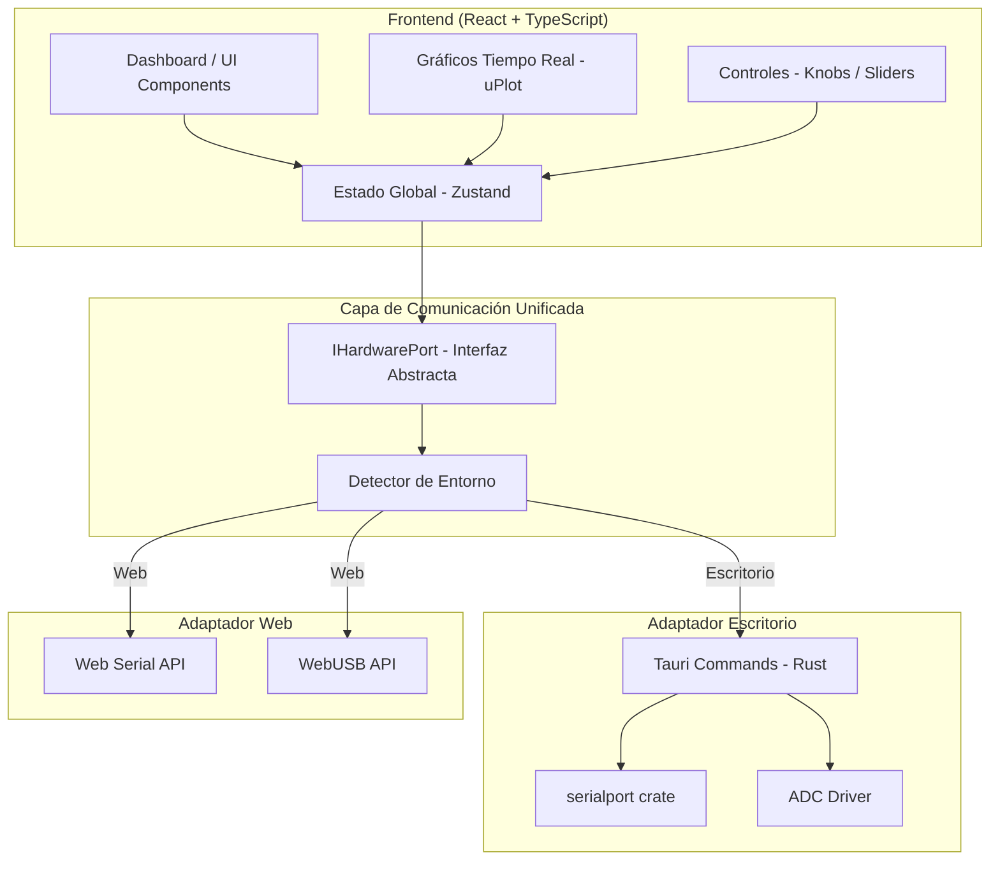
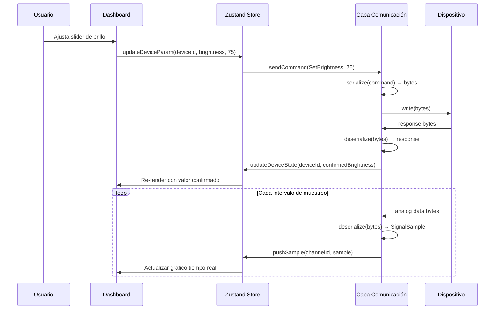

# Documento de Diseño: Controlador de Hardware con Tauri

## Visión General

Este documento describe el diseño técnico de una aplicación Tauri que permite controlar y monitorear dispositivos de hardware (luces, actuadores, audio) y leer señales analógicas (temperatura, voltaje, corriente, audio, presión). La aplicación funciona tanto como app de escritorio (Windows, Mac, Linux) como aplicación web (desplegada en S3+CloudFront), con una capa de comunicación unificada que abstrae las diferencias entre el backend nativo de Rust (serial/ADC) y las APIs del navegador (Web Serial API / WebUSB).

### Decisiones de Diseño

- **Framework**: Tauri v2 con frontend en TypeScript/React. Tauri permite compilar la misma base de código como app nativa y exportar el frontend como SPA para despliegue web.
- **Backend nativo**: Rust con la crate `serialport` para comunicación serial y acceso a ADC en modo escritorio.
- **Frontend**: React + TypeScript con Vite como bundler. El frontend es idéntico para escritorio y web.
- **Gráficos en tiempo real**: `uPlot` — librería ligera y de alto rendimiento para gráficos de series temporales. Ideal para datos de alta frecuencia (hasta 10 kHz).
- **Controles UI**: Componentes custom de perilla (knob) y slider construidos con SVG/Canvas para máxima personalización y rendimiento.
- **Serialización binaria**: Protocolo binario custom con header fijo (tipo de comando + longitud) y payload variable. Se usa `DataView` / `ArrayBuffer` en JS y `byteorder` en Rust.
- **State management**: Zustand — ligero, sin boilerplate, ideal para estado reactivo de dispositivos y señales.
- **Persistencia de layout**: `localStorage` para guardar la configuración del dashboard.
- **Exportación CSV**: Generación client-side usando `Blob` API.

## Arquitectura

La aplicación sigue una arquitectura de capas con un patrón adaptador para la comunicación con hardware:



### Flujo de Datos



## Componentes e Interfaces

### Estructura del Proyecto

```
tauri-hardware-controller/
├── src-tauri/
│   ├── src/
│   │   ├── main.rs              # Entry point Tauri
│   │   ├── serial_port.rs       # Comunicación serial nativa
│   │   ├── adc_driver.rs        # Lectura ADC nativa
│   │   └── commands.rs          # Tauri commands expuestos al frontend
│   └── Cargo.toml
├── src/
│   ├── App.tsx                  # Componente raíz
│   ├── main.tsx                 # Entry point React
│   ├── communication/
│   │   ├── types.ts             # Interfaces y tipos compartidos
│   │   ├── hardware-port.ts     # Interfaz IHardwarePort
│   │   ├── desktop-adapter.ts   # Adaptador Tauri/Rust
│   │   ├── web-serial-adapter.ts# Adaptador Web Serial API
│   │   ├── web-usb-adapter.ts   # Adaptador WebUSB
│   │   ├── environment.ts       # Detector de entorno
│   │   └── serialization.ts     # Serialización/deserialización binaria
│   ├── store/
│   │   ├── device-store.ts      # Estado de dispositivos
│   │   └── signal-store.ts      # Estado de señales analógicas
│   ├── components/
│   │   ├── Dashboard.tsx        # Layout principal
│   │   ├── DeviceList.tsx       # Lista de dispositivos
│   │   ├── RealTimeChart.tsx    # Gráfico tiempo real (uPlot)
│   │   ├── KnobControl.tsx      # Control tipo perilla
│   │   ├── SliderControl.tsx    # Control tipo slider
│   │   ├── AlertPanel.tsx       # Panel de alertas
│   │   └── LogPanel.tsx         # Panel de log/depuración
│   └── utils/
│       ├── csv-export.ts        # Exportación a CSV
│       └── metrics.ts           # Cálculo de métricas (min, max, promedio)
├── package.json
├── vite.config.ts
└── tsconfig.json
```

### Interfaz Principal: `IHardwarePort`

```typescript
// src/communication/hardware-port.ts

export interface PortInfo {
  path: string;
  manufacturer?: string;
  productId?: string;
  vendorId?: string;
}

export interface IHardwarePort {
  /** Lista puertos disponibles */
  listPorts(): Promise<PortInfo[]>;

  /** Abre conexión con un puerto específico */
  connect(portPath: string, baudRate: number): Promise<void>;

  /** Cierra la conexión activa */
  disconnect(): Promise<void>;

  /** Envía bytes al dispositivo */
  write(data: Uint8Array): Promise<void>;

  /** Registra callback para datos entrantes */
  onData(callback: (data: Uint8Array) => void): void;

  /** Registra callback para errores de conexión */
  onError(callback: (error: Error) => void): void;

  /** Registra callback para desconexión */
  onDisconnect(callback: () => void): void;

  /** Indica si hay una conexión activa */
  isConnected(): boolean;
}
```

### Detector de Entorno

```typescript
// src/communication/environment.ts

export type RuntimeEnvironment = 'desktop' | 'web';

export function detectEnvironment(): RuntimeEnvironment {
  // window.__TAURI__ existe solo en el contexto de Tauri desktop
  return typeof window !== 'undefined' && '__TAURI__' in window
    ? 'desktop'
    : 'web';
}

export function createHardwarePort(): IHardwarePort {
  const env = detectEnvironment();
  if (env === 'desktop') {
    return new DesktopAdapter();
  }
  // Priorizar Web Serial sobre WebUSB
  if ('serial' in navigator) {
    return new WebSerialAdapter();
  }
  if ('usb' in navigator) {
    return new WebUSBAdapter();
  }
  throw new Error('El navegador no soporta Web Serial API ni WebUSB.');
}
```

### Serialización Binaria de Comandos

```typescript
// src/communication/serialization.ts

/**
 * Formato binario de un Comando_Hardware:
 * [1 byte: tipo de comando] [2 bytes: longitud payload] [N bytes: payload]
 *
 * Tipos de comando:
 *   0x01 = SetBrightness    payload: [1 byte: valor 0-100]
 *   0x02 = SetActuatorPos   payload: [2 bytes: posición uint16]
 *   0x03 = SetActuatorSpeed payload: [2 bytes: velocidad uint16]
 *   0x04 = SetVolume        payload: [1 byte: valor 0-100]
 *   0x05 = SelectAudioSource payload: [1 byte: canal]
 *   0x06 = ToggleLight      payload: [1 byte: 0=off, 1=on]
 *   0x10 = ScanPorts        payload: vacío
 *   0x11 = Disconnect       payload: vacío
 */

export enum CommandType {
  SetBrightness = 0x01,
  SetActuatorPos = 0x02,
  SetActuatorSpeed = 0x03,
  SetVolume = 0x04,
  SelectAudioSource = 0x05,
  ToggleLight = 0x06,
  ScanPorts = 0x10,
  Disconnect = 0x11,
}

export interface HardwareCommand {
  type: CommandType;
  payload: number[];
}

export function serialize(command: HardwareCommand): Uint8Array {
  const payloadLength = command.payload.length;
  const buffer = new ArrayBuffer(3 + payloadLength);
  const view = new DataView(buffer);
  view.setUint8(0, command.type);
  view.setUint16(1, payloadLength, false); // big-endian
  const arr = new Uint8Array(buffer);
  for (let i = 0; i < payloadLength; i++) {
    arr[3 + i] = command.payload[i];
  }
  return arr;
}

export function deserialize(data: Uint8Array): HardwareCommand {
  if (data.length < 3) {
    throw new Error(`Datos insuficientes: se esperan al menos 3 bytes, se recibieron ${data.length}`);
  }
  const view = new DataView(data.buffer, data.byteOffset, data.byteLength);
  const type = view.getUint8(0) as CommandType;
  const payloadLength = view.getUint16(1, false);
  if (data.length < 3 + payloadLength) {
    throw new Error(`Payload incompleto: se esperan ${payloadLength} bytes, se recibieron ${data.length - 3}`);
  }
  const payload: number[] = [];
  for (let i = 0; i < payloadLength; i++) {
    payload.push(data[3 + i]);
  }
  return { type, payload };
}

export function prettyPrint(command: HardwareCommand): string {
  const typeName = CommandType[command.type] ?? `Unknown(0x${command.type.toString(16)})`;
  const payloadHex = command.payload.map(b => b.toString(16).padStart(2, '0')).join(' ');
  return `[${typeName}] payload: [${payloadHex}]`;
}
```

### Store de Dispositivos (Zustand)

```typescript
// src/store/device-store.ts

export type ConnectionStatus = 'disconnected' | 'connecting' | 'connected';

export interface DeviceState {
  id: string;
  portPath: string;
  name: string;
  status: ConnectionStatus;
  lastSeen: number; // timestamp
  params: Record<string, number>; // e.g. { brightness: 75, volume: 50 }
}
```

### Store de Señales Analógicas (Zustand)

```typescript
// src/store/signal-store.ts

export type SignalUnit = '°C' | 'V' | 'A' | 'Pa' | 'dB';

export interface SignalChannel {
  id: string;
  name: string;
  unit: SignalUnit;
  sampleRateHz: number;
  thresholdMin?: number;
  thresholdMax?: number;
  samples: { timestamp: number; value: number }[];
}

export interface SignalMetrics {
  min: number;
  max: number;
  avg: number;
}
```

### Cálculo de Métricas

```typescript
// src/utils/metrics.ts

export function computeMetrics(values: number[]): SignalMetrics {
  if (values.length === 0) {
    return { min: 0, max: 0, avg: 0 };
  }
  let min = values[0];
  let max = values[0];
  let sum = 0;
  for (const v of values) {
    if (v < min) min = v;
    if (v > max) max = v;
    sum += v;
  }
  return { min, max, avg: sum / values.length };
}
```

### Exportación CSV

```typescript
// src/utils/csv-export.ts

export function exportToCSV(
  channels: { name: string; unit: string; samples: { timestamp: number; value: number }[] }[]
): string {
  const header = 'timestamp,' + channels.map(c => `${c.name} (${c.unit})`).join(',');
  // Recopilar todos los timestamps únicos y ordenarlos
  const allTimestamps = [...new Set(channels.flatMap(c => c.samples.map(s => s.timestamp)))].sort();
  const rows = allTimestamps.map(ts => {
    const values = channels.map(c => {
      const sample = c.samples.find(s => s.timestamp === ts);
      return sample ? sample.value.toString() : '';
    });
    return `${ts},${values.join(',')}`;
  });
  return [header, ...rows].join('\n');
}
```

## Modelos de Datos

### Comando de Hardware (HardwareCommand)

```typescript
{
  type: CommandType;    // enum: tipo de comando (SetBrightness, SetVolume, etc.)
  payload: number[];    // bytes del payload variable según el tipo
}
```

### Estado de Dispositivo (DeviceState)

```typescript
{
  id: string;                        // identificador único del dispositivo
  portPath: string;                  // ruta del puerto (e.g. "COM3", "/dev/ttyUSB0")
  name: string;                      // nombre descriptivo
  status: ConnectionStatus;          // 'disconnected' | 'connecting' | 'connected'
  lastSeen: number;                  // timestamp de última comunicación
  params: Record<string, number>;    // parámetros actuales del dispositivo
}
```

### Canal de Señal Analógica (SignalChannel)

```typescript
{
  id: string;                        // identificador del canal
  name: string;                      // nombre descriptivo (e.g. "Temperatura Sensor 1")
  unit: SignalUnit;                  // unidad de medida: '°C' | 'V' | 'A' | 'Pa' | 'dB'
  sampleRateHz: number;             // frecuencia de muestreo (1 - 10000)
  thresholdMin?: number;            // umbral mínimo para alertas
  thresholdMax?: number;            // umbral máximo para alertas
  samples: SignalSample[];          // buffer circular de muestras
}
```

### Muestra de Señal (SignalSample)

```typescript
{
  timestamp: number;    // timestamp en milisegundos
  value: number;        // valor de la señal en la unidad correspondiente
}
```

### Configuración de Dashboard (DashboardLayout)

```typescript
{
  widgets: {
    id: string;
    type: 'chart' | 'knob' | 'slider' | 'metric' | 'status';
    position: { x: number; y: number; w: number; h: number };
    config: Record<string, unknown>; // configuración específica del widget
  }[];
}
```

### Resultado de Exportación CSV

```
timestamp,Temperatura (°C),Voltaje (V),Corriente (A)
1700000000000,23.5,5.02,0.15
1700000001000,23.6,5.01,0.16
...
```


## Propiedades de Correctitud

*Una propiedad es una característica o comportamiento que debe cumplirse en todas las ejecuciones válidas de un sistema — esencialmente, una declaración formal sobre lo que el sistema debe hacer. Las propiedades sirven como puente entre especificaciones legibles por humanos y garantías de correctitud verificables por máquinas.*

### Propiedad 1: Round-trip de serialización de comandos

*Para cualquier* `HardwareCommand` válido (con un `CommandType` válido y un payload de longitud correcta para ese tipo), `deserialize(serialize(command))` debe producir un objeto equivalente al original.

**Valida: Requisitos 11.1, 11.2, 11.4**

### Propiedad 2: Construcción correcta de comandos para cualquier tipo y valor de parámetro

*Para cualquier* tipo de comando (brillo 0–100, posición de actuador uint16, velocidad de actuador uint16, volumen 0–100, canal de audio, toggle on/off) y cualquier valor válido dentro de su rango, la construcción del `HardwareCommand` debe producir un payload que, al ser deserializado, contenga exactamente el valor original del parámetro.

**Valida: Requisitos 2.1, 3.1, 4.1**

### Propiedad 3: Clamping de valores de actuador dentro de límites

*Para cualquier* valor de entrada numérico y cualquier rango de límites `[min, max]` definido por el usuario, el valor enviado al dispositivo debe satisfacer `min <= valorEnviado <= max`. Si el valor de entrada está fuera del rango, debe ser restringido al límite más cercano.

**Valida: Requisito 3.3**

### Propiedad 4: Validación de frecuencia de muestreo

*Para cualquier* valor de frecuencia de muestreo, la App debe aceptar únicamente valores en el rango [1, 10000] Hz. Valores fuera de este rango deben ser rechazados o restringidos.

**Valida: Requisito 5.2**

### Propiedad 5: Detección de umbral genera alerta

*Para cualquier* valor de señal analógica y cualquier par de umbrales (min, max) configurados, si el valor excede `thresholdMax` o está por debajo de `thresholdMin`, el sistema debe generar una alerta. Si el valor está dentro del rango, no debe generarse alerta.

**Valida: Requisito 5.5**

### Propiedad 6: Filtrado de datos por rango temporal

*Para cualquier* conjunto de muestras con timestamps y cualquier rango de tiempo `[tStart, tEnd]`, los datos retornados por la función de filtrado deben contener únicamente muestras cuyo timestamp esté dentro del rango `tStart <= timestamp <= tEnd`, y deben contener todas las muestras que cumplan esa condición.

**Valida: Requisito 6.2**

### Propiedad 7: Correctitud de métricas derivadas (min, max, promedio)

*Para cualquier* array no vacío de valores numéricos, `computeMetrics(values)` debe retornar: `min` menor o igual a todos los valores, `max` mayor o igual a todos los valores, y `avg` igual a la suma de todos los valores dividida por la cantidad de valores.

**Valida: Requisito 7.4**

### Propiedad 8: Round-trip de persistencia de layout del dashboard

*Para cualquier* configuración de layout de dashboard válida (con widgets, posiciones y configuraciones), guardar el layout en localStorage y luego leerlo debe producir un objeto equivalente al original.

**Valida: Requisito 7.3**

### Propiedad 9: Exportación CSV contiene todos los datos

*Para cualquier* conjunto de canales de señal con muestras, la función `exportToCSV` debe producir un string CSV donde: la primera fila contiene los nombres de todos los canales con sus unidades, y para cada timestamp presente en los datos, existe una fila con ese timestamp y los valores correspondientes de cada canal.

**Valida: Requisito 7.5**

### Propiedad 10: Pretty-print de comandos contiene tipo y payload

*Para cualquier* `HardwareCommand` válido, `prettyPrint(command)` debe retornar un string que contenga el nombre del tipo de comando y la representación hexadecimal de cada byte del payload.

**Valida: Requisito 11.3**

### Propiedad 11: Datos binarios inválidos producen error de deserialización

*Para cualquier* secuencia de bytes que no cumpla el formato binario definido (menos de 3 bytes, o longitud de payload declarada mayor que los bytes disponibles), `deserialize` debe lanzar un error descriptivo sin producir un comando parcial o corrupto.

**Valida: Requisito 11.5**

### Propiedad 12: Selección correcta de adaptador según entorno

*Para cualquier* combinación de entorno de ejecución (presencia/ausencia de `window.__TAURI__`, `navigator.serial`, `navigator.usb`), `createHardwarePort()` debe retornar el adaptador correspondiente: `DesktopAdapter` si `__TAURI__` está presente, `WebSerialAdapter` si `navigator.serial` está disponible, `WebUSBAdapter` si `navigator.usb` está disponible, o lanzar error si ninguno está disponible.

**Valida: Requisito 10.2**

## Manejo de Errores

La aplicación implementa una estrategia de manejo de errores por capas, donde cada capa captura y transforma errores para presentarlos de forma apropiada al usuario.

### Tabla de Errores

| Capa | Condición de Error | Comportamiento | Requisito |
|------|-------------------|----------------|-----------|
| Comunicación | Puerto serial no disponible | Mostrar error en lista de dispositivos, no intentar conexión | 1.1 |
| Comunicación | Fallo al abrir puerto serial | Mostrar error con nombre del puerto, estado "Desconectado" | 1.2 |
| Comunicación | Pérdida inesperada de conexión | Notificación de desconexión, estado "Desconectado" en < 2s | 1.4 |
| Comunicación | Navegador no soporta Web Serial ni WebUSB | Mensaje informativo con navegadores compatibles | 9.5 |
| Comandos | Dispositivo no responde en 3 segundos | Timeout, mensaje de error "Dispositivo no respondió" | 2.4 |
| Comandos | Actuador reporta sobrecarga | Detener envío de comandos, alerta de sobrecarga | 3.4 |
| Comandos | Error de reproducción de audio | Mensaje de error descriptivo en Dashboard | 4.4 |
| Serialización | Datos recibidos con formato inválido | Registrar error en panel de log, descartar datos | 11.5 |
| Serialización | Payload incompleto o corrupto | Registrar error en panel de log, descartar datos | 11.5 |
| Señales | Valor de señal excede umbral | Alerta visual en Dashboard (no es error fatal) | 5.5 |
| Dashboard | Fallo al persistir layout en localStorage | Mostrar advertencia, continuar operación normal | 7.3 |
| Exportación | Fallo al generar CSV | Mostrar error, no descargar archivo corrupto | 7.5 |

### Estrategia de Timeout

- **Comandos de hardware**: Timeout de 3 segundos por comando. Si no hay respuesta, se marca como fallido y se notifica al usuario.
- **Detección de desconexión**: El adaptador de comunicación emite evento `onDisconnect` que el store procesa en menos de 2 segundos.
- **Reconexión**: No se implementa reconexión automática. El usuario debe reconectar manualmente.

### Panel de Log

Todos los errores de serialización/deserialización se registran en el panel de log con:
- Timestamp del error
- Bytes recibidos (en hexadecimal)
- Descripción del error
- Esto permite depuración sin interrumpir el flujo de trabajo del usuario.

## Estrategia de Testing

### Enfoque Dual

Se utilizan dos tipos de tests complementarios:

1. **Tests unitarios**: Verifican ejemplos específicos, casos borde y condiciones de error.
2. **Tests de propiedades (property-based)**: Verifican propiedades universales con entradas generadas aleatoriamente.

### Librería de Property-Based Testing

Se utilizará **fast-check** (`fast-check` npm package), la librería de property-based testing más madura para JavaScript/TypeScript.

### Configuración de Tests de Propiedades

- Cada test de propiedad debe ejecutar un mínimo de **100 iteraciones**.
- Cada test debe incluir un comentario que referencia la propiedad del documento de diseño.
- Formato del tag: **Feature: tauri-hardware-controller, Property {número}: {texto de la propiedad}**
- Cada propiedad de correctitud debe ser implementada por un **único** test de propiedad.

### Tests de Propiedades (basados en las Propiedades de Correctitud)

| Test | Propiedad | Descripción |
|------|-----------|-------------|
| P1 | Propiedad 1 | Generar `HardwareCommand` aleatorios con tipos y payloads válidos, serializar y deserializar, verificar equivalencia. |
| P2 | Propiedad 2 | Generar valores aleatorios para cada tipo de comando (brillo 0-100, posición uint16, etc.), construir el comando, verificar que el payload contiene el valor correcto. |
| P3 | Propiedad 3 | Generar valores numéricos aleatorios y rangos `[min, max]` aleatorios, aplicar clamping, verificar que el resultado está dentro del rango. |
| P4 | Propiedad 4 | Generar frecuencias aleatorias (incluyendo fuera de rango), verificar que solo se aceptan valores entre 1 y 10000 Hz. |
| P5 | Propiedad 5 | Generar valores de señal y umbrales aleatorios, verificar que la alerta se genera si y solo si el valor excede los umbrales. |
| P6 | Propiedad 6 | Generar arrays de muestras con timestamps aleatorios y rangos de tiempo aleatorios, filtrar, verificar que solo se incluyen muestras dentro del rango. |
| P7 | Propiedad 7 | Generar arrays de números aleatorios, calcular métricas, verificar que min <= todos, max >= todos, avg = sum/count. |
| P8 | Propiedad 8 | Generar layouts de dashboard aleatorios, guardar en localStorage (mock), leer, verificar equivalencia. |
| P9 | Propiedad 9 | Generar canales con muestras aleatorias, exportar a CSV, parsear el CSV, verificar que contiene todos los timestamps y valores. |
| P10 | Propiedad 10 | Generar comandos aleatorios, ejecutar prettyPrint, verificar que el string contiene el nombre del tipo y los bytes hex del payload. |
| P11 | Propiedad 11 | Generar secuencias de bytes aleatorias inválidas (< 3 bytes, payload incompleto), verificar que deserialize lanza error. |
| P12 | Propiedad 12 | Generar combinaciones aleatorias de flags de entorno (__TAURI__, navigator.serial, navigator.usb), verificar que se selecciona el adaptador correcto. |

### Tests Unitarios

| Test | Requisito | Descripción |
|------|-----------|-------------|
| U1 | 1.3 | Verificar que cuando el store tiene `status='connected'`, el componente muestra "Conectado". |
| U2 | 1.4 | Verificar que al emitir `onDisconnect`, el estado cambia a "Desconectado". |
| U3 | 1.5 | Verificar que `disconnect()` cambia el estado y llama al adaptador. |
| U4 | 2.2 | Verificar que al recibir confirmación del dispositivo, el slider refleja el valor confirmado. |
| U5 | 2.3 | Verificar que toggle on/off envía el comando correcto (0x06 con payload 0 o 1). |
| U6 | 2.4 | Verificar que si no hay respuesta en 3 segundos, se muestra error de timeout. |
| U7 | 3.4 | Verificar que al recibir señal de sobrecarga, se detienen los comandos y se muestra alerta. |
| U8 | 4.2 | Verificar que seleccionar una fuente de audio envía el comando correcto. |
| U9 | 5.4 | Verificar que cada tipo de señal muestra la unidad correcta (°C, V, A, Pa, dB). |
| U10 | 6.3 | Verificar que el componente de gráfico acepta múltiples series de datos. |
| U11 | 6.4 | Verificar que al pausar un gráfico, los datos se congelan en el último estado. |
| U12 | 6.5 | Verificar que al reanudar un gráfico pausado, se actualiza desde el punto actual. |
| U13 | 7.1 | Verificar que el dashboard muestra el estado de conexión de cada dispositivo. |
| U14 | 9.2 | Verificar que en modo web se solicitan permisos del navegador antes de conectar. |
| U15 | 9.5 | Verificar que si el navegador no soporta Web Serial ni WebUSB, se muestra mensaje informativo. |

### Framework de Testing

- **Vitest** como test runner (rápido, compatible con TypeScript y ESM).
- **fast-check** para property-based testing.
- **@testing-library/react** para tests de componentes UI.
- Los tests se ubican en `src/__tests__/` con la convención `*.test.ts` para lógica y `*.test.tsx` para componentes.
- Los adaptadores de hardware se mockean para aislar la lógica de la comunicación real con dispositivos.
