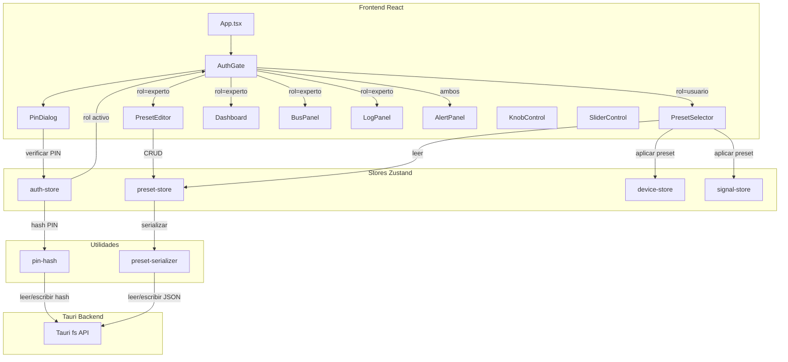
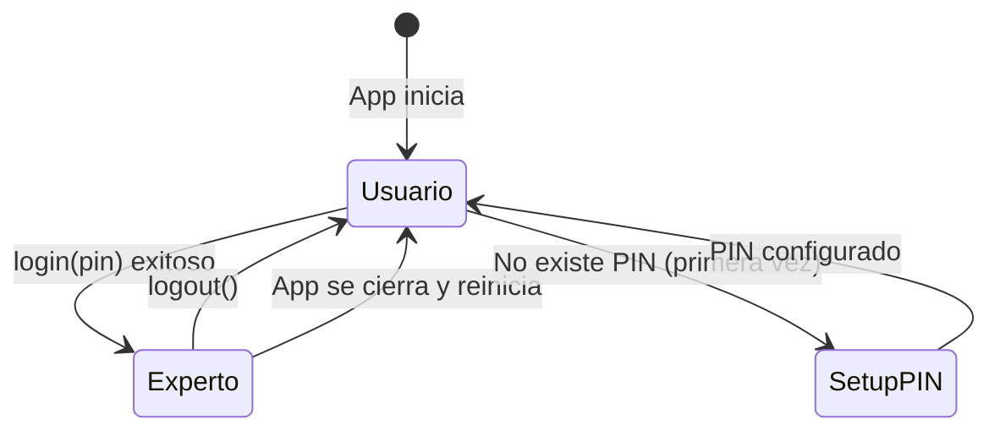
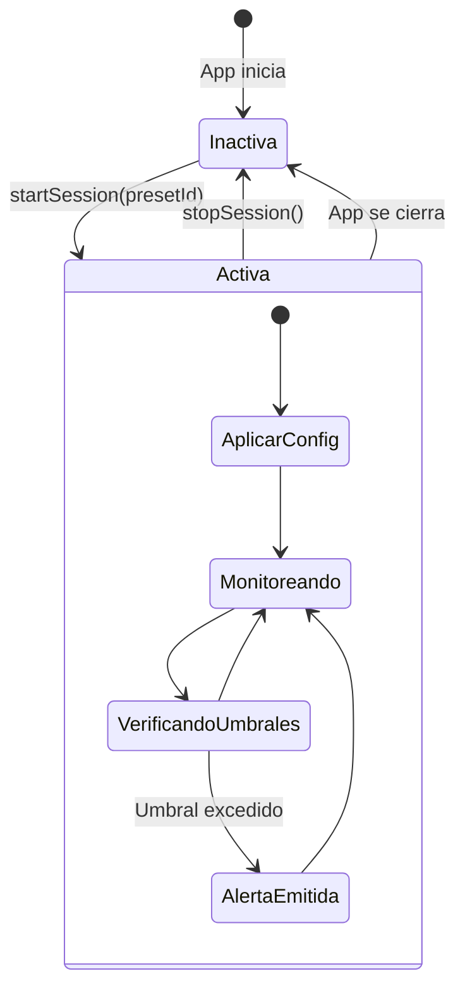

# Documento de Diseño — Roles de Usuario

## Resumen

Este documento describe el diseño técnico del sistema de roles de usuario para la aplicación de escritorio Tauri de control de hardware de tanques de flotación. El sistema implementa dos roles (Experto y Usuario) con autenticación local por PIN, gestión de presets de sesión almacenados en JSON, y renderizado condicional de la interfaz según el rol activo.

La arquitectura se integra con los stores Zustand existentes (`device-store`, `signal-store`) y los componentes de UI actuales (`Dashboard`, `BusPanel`, `AlertPanel`, `LogPanel`, `KnobControl`, `SliderControl`), añadiendo dos nuevos stores (`auth-store`, `preset-store`) y un módulo de serialización de presets.

## Arquitectura



### Decisiones de Diseño

1. **Zustand para estado de autenticación**: Consistente con los stores existentes (`device-store`, `signal-store`). El `auth-store` mantiene el rol activo y el estado de sesión en memoria, sin persistir la sesión.

2. **Hash SHA-256 para PIN**: Se usa `crypto.subtle.digest('SHA-256', ...)` disponible en el contexto WebView de Tauri. No se requiere dependencia externa. El hash se almacena en un archivo local vía Tauri fs API.

3. **Archivo JSON único para presets**: Un solo archivo `presets.json` en el directorio de datos de la aplicación (`appDataDir`). Simplicidad sobre complejidad — un archivo es suficiente para el volumen esperado de presets.

4. **Renderizado condicional en AuthGate**: Un componente wrapper que lee el rol del `auth-store` y renderiza condicionalmente los componentes hijos. Evita lógica de permisos dispersa en cada componente.

5. **Serialización pura**: El módulo `preset-serializer` es una colección de funciones puras (sin estado, sin efectos secundarios) que convierten entre objetos `SessionPreset` y JSON. Facilita testing con propiedades.

## Componentes e Interfaces

### auth-store (Zustand Store)

```typescript
type UserRole = 'expert' | 'user';

interface AuthState {
  role: UserRole;
  pinHashExists: boolean;

  login: (pin: string) => Promise<boolean>;
  logout: () => void;
  setupPin: (pin: string) => Promise<void>;
  changePin: (currentPin: string, newPin: string) => Promise<boolean>;
  loadPinStatus: () => Promise<void>;
}
```

- `role` inicia como `'user'` (Req 1.1).
- `login()` hashea el PIN, lo compara con el hash almacenado, y cambia el rol si coincide (Req 2.1, 2.2).
- `logout()` restablece el rol a `'user'` (Req 3.1).
- `setupPin()` se usa solo cuando no existe PIN previo (Req 2.5).
- `changePin()` verifica el PIN actual antes de aceptar el nuevo (Req 2.6).
- `loadPinStatus()` verifica si existe un archivo de hash de PIN al iniciar la app (Req 2.5).

### preset-store (Zustand Store)

```typescript
interface PresetStoreState {
  presets: SessionPreset[];
  activePresetId: string | null;
  sessionActive: boolean;
  loading: boolean;
  error: string | null;

  loadPresets: () => Promise<void>;
  createPreset: (preset: Omit<SessionPreset, 'id'>) => Promise<boolean>;
  updatePreset: (id: string, updates: Partial<Omit<SessionPreset, 'id'>>) => Promise<boolean>;
  deletePreset: (id: string) => Promise<boolean>;
  startSession: (presetId: string) => void;
  stopSession: () => void;
}
```

- `loadPresets()` lee el archivo JSON al iniciar (Req 7.2).
- `createPreset()` valida campos obligatorios y nombres duplicados antes de guardar (Req 6.2, 6.4).
- `deletePreset()` requiere confirmación previa en la UI (Req 6.3).
- `startSession()` aplica la configuración del preset a `signal-store` y `device-store` (Req 8.2).
- `stopSession()` detiene lecturas y restablece actuadores a valores seguros (Req 8.3).

### pin-hash (Módulo Utilitario)

```typescript
function hashPin(pin: string): Promise<string>;
function validatePinFormat(pin: string): boolean;
function readPinHash(): Promise<string | null>;
function writePinHash(hash: string): Promise<void>;
```

- `hashPin()` usa `crypto.subtle.digest('SHA-256', ...)` y retorna hex string.
- `validatePinFormat()` verifica que el PIN sea 4-8 dígitos numéricos (Req 2.4).
- `readPinHash()` / `writePinHash()` usan Tauri fs API para leer/escribir el archivo de hash.

### preset-serializer (Módulo Utilitario)

```typescript
function serializePresets(presets: SessionPreset[]): string;
function deserializePresets(json: string): SessionPreset[];
function validatePreset(preset: unknown): { valid: boolean; errors: string[] };
```

- Funciones puras para conversión JSON ↔ objetos (Req 7.5, 7.6, 7.7).
- `validatePreset()` verifica estructura y campos obligatorios.

### AuthGate (Componente React)

Componente wrapper que lee `auth-store.role` y renderiza condicionalmente:
- **Rol Experto**: Dashboard completo, BusPanel, LogPanel, KnobControl, SliderControl, PresetEditor, controles de umbrales.
- **Rol Usuario**: PresetSelector, gráficos en tiempo real (solo lectura), AlertPanel, controles de sesión (iniciar/detener).
- **Ambos roles**: AlertPanel, botón de login/logout.

### PinDialog (Componente React)

Diálogo modal para:
- Introducir PIN para login.
- Configurar PIN inicial (primera ejecución).
- Cambiar PIN (requiere PIN actual + nuevo PIN).

### PresetSelector (Componente React)

Vista de solo lectura para el Rol_Usuario:
- Lista de presets disponibles con nombre descriptivo.
- Botón para iniciar sesión con el preset seleccionado.
- Botón para detener sesión activa.
- Indicador de sesión activa y preset en uso.

### PresetEditor (Componente React)

Formulario CRUD para el Rol_Experto:
- Crear nuevo preset con nombre, canales, tasas de muestreo, umbrales y valores de actuadores.
- Editar preset existente.
- Eliminar preset con diálogo de confirmación.

## Modelos de Datos

### SessionPreset

```typescript
interface PresetChannel {
  channelId: string;
  name: string;
  unit: SignalUnit;
  sampleRateHz: number;
  thresholdMin?: number;
  thresholdMax?: number;
}

interface PresetActuator {
  deviceId: string;
  paramName: string;
  value: number;
}

interface SessionPreset {
  id: string;                    // UUID generado al crear
  name: string;                  // Nombre descriptivo, único
  channels: PresetChannel[];     // Canales de señal con configuración
  actuators: PresetActuator[];   // Valores de actuadores
}
```

### Archivo JSON de Presets (presets.json)

```json
{
  "version": 1,
  "presets": [
    {
      "id": "uuid-1",
      "name": "Sesión Estándar",
      "channels": [
        {
          "channelId": "temp-1",
          "name": "Temperatura Agua",
          "unit": "°C",
          "sampleRateHz": 2,
          "thresholdMin": 34.0,
          "thresholdMax": 37.0
        }
      ],
      "actuators": [
        {
          "deviceId": "heater-1",
          "paramName": "temperature",
          "value": 35
        }
      ]
    }
  ]
}
```

### Archivo de Hash de PIN (pin-hash.dat)

Archivo de texto plano que contiene únicamente el hash SHA-256 del PIN en formato hexadecimal (64 caracteres).

```
e3b0c44298fc1c149afbf4c8996fb92427ae41e4649b934ca495991b7852b855
```

### Flujo de Estado del Auth Store



### Flujo de Sesión de Preset




## Propiedades de Corrección

*Una propiedad es una característica o comportamiento que debe mantenerse verdadero en todas las ejecuciones válidas de un sistema — esencialmente, una declaración formal sobre lo que el sistema debe hacer. Las propiedades sirven como puente entre especificaciones legibles por humanos y garantías de corrección verificables por máquina.*

### Propiedad 1: Ida y vuelta de autenticación por PIN

*Para cualquier* PIN válido (4-8 dígitos numéricos), si se configura como PIN del sistema y luego se intenta login con el mismo PIN, el login debe tener éxito y el rol debe cambiar a `'expert'`. Si se intenta login con cualquier otro PIN diferente, el login debe fallar y el rol debe permanecer como `'user'`.

**Valida: Requisitos 2.1, 2.2**

### Propiedad 2: Validación de formato de PIN

*Para cualquier* cadena de texto, `validatePinFormat` debe retornar `true` si y solo si la cadena consiste exclusivamente en dígitos numéricos (0-9) y tiene una longitud entre 4 y 8 caracteres inclusive.

**Valida: Requisito 2.4**

### Propiedad 3: Cambio de PIN requiere PIN actual correcto

*Para cualquier* PIN configurado y cualquier par (intento de PIN actual, nuevo PIN), `changePin` debe tener éxito solo si el intento de PIN actual coincide con el PIN configurado. Si no coincide, el PIN almacenado no debe cambiar.

**Valida: Requisito 2.6**

### Propiedad 4: Logout siempre restablece a rol usuario

*Para cualquier* estado del auth store donde el rol sea `'expert'`, invocar `logout()` debe resultar en que el rol sea `'user'`.

**Valida: Requisitos 3.1, 3.3**

### Propiedad 5: Visibilidad de componentes según rol

*Para cualquier* rol activo y cualquier componente de la interfaz, la visibilidad del componente debe coincidir con la tabla de permisos: en rol `'expert'` todos los componentes son visibles; en rol `'user'`, BusPanel, LogPanel, controles de actuadores (KnobControl/SliderControl directos), controles de umbrales y editor de presets deben estar ocultos, mientras que AlertPanel, gráficos en solo lectura y PresetSelector deben estar visibles.

**Valida: Requisitos 4.1, 4.2, 4.3, 4.4, 4.5, 5.1, 5.2, 5.3, 5.4**

### Propiedad 6: Validación de preset rechaza campos obligatorios faltantes

*Para cualquier* objeto parcial de preset donde al menos un campo obligatorio (name, channels) esté ausente o vacío, `validatePreset` debe retornar `{ valid: false }` con errores descriptivos.

**Valida: Requisito 6.2**

### Propiedad 7: No se permiten presets con nombres duplicados

*Para cualquier* lista de presets existentes y un nuevo preset cuyo nombre coincida con uno existente, `createPreset` debe rechazar la creación y la lista de presets debe permanecer sin cambios.

**Valida: Requisito 6.4**

### Propiedad 8: Ida y vuelta de serialización de presets

*Para cualquier* objeto `SessionPreset` válido, serializar con `serializePresets` y luego deserializar con `deserializePresets` debe producir un objeto equivalente al original.

**Valida: Requisitos 7.5, 7.6, 7.7**

### Propiedad 9: Iniciar sesión aplica configuración del preset

*Para cualquier* preset válido con canales y actuadores definidos, al invocar `startSession(presetId)`, los canales del `signal-store` deben reflejar las tasas de muestreo y umbrales del preset, y los parámetros del `device-store` deben reflejar los valores de actuadores del preset.

**Valida: Requisito 8.2**

### Propiedad 10: Alertas de umbral coinciden con umbrales del preset

*Para cualquier* canal con umbrales definidos en el preset activo y cualquier valor de señal, se debe generar una alerta si y solo si el valor excede el umbral mínimo o máximo definido en el preset.

**Valida: Requisito 8.5**

## Manejo de Errores

| Escenario | Comportamiento | Requisito |
|---|---|---|
| PIN inválido en login | Mantener rol `'user'`, mostrar mensaje "PIN incorrecto" | 2.2 |
| PIN con formato inválido (no 4-8 dígitos) | Rechazar antes de intentar hash, mostrar error de formato | 2.4 |
| Archivo de hash de PIN no encontrado | Activar flujo de configuración inicial de PIN | 2.5 |
| PIN actual incorrecto al cambiar PIN | Rechazar cambio, mantener PIN anterior | 2.6 |
| Archivo presets.json no existe | Crear archivo vacío `{"version":1,"presets":[]}` | 7.3 |
| Archivo presets.json corrupto/inválido | Registrar error en log, cargar lista vacía de presets | 7.4 |
| Preset con nombre duplicado | Rechazar creación, retornar error descriptivo | 6.4 |
| Preset con campos obligatorios faltantes | Rechazar creación/edición, retornar lista de errores | 6.2 |
| Error de escritura en Tauri fs API | Capturar excepción, mostrar error al usuario, mantener estado anterior | 7.1 |
| Inicio de sesión con preset inexistente | Ignorar operación, registrar advertencia | 8.2 |

## Estrategia de Testing

### Enfoque Dual

Se utilizan dos tipos de tests complementarios:

- **Tests unitarios**: Verifican ejemplos específicos, casos borde y condiciones de error. Se enfocan en escenarios concretos como el estado inicial del store, el flujo de primera configuración de PIN, y la carga de archivo JSON corrupto.
- **Tests de propiedades (PBT)**: Verifican propiedades universales con entradas generadas aleatoriamente. Cada propiedad del documento de diseño se implementa como un test de propiedades individual.

### Librería de Property-Based Testing

Se usa **fast-check** (ya instalada en el proyecto, versión ^3.23.1) con Vitest.

### Configuración de Tests de Propiedades

- Mínimo **100 iteraciones** por test de propiedad.
- Cada test debe incluir un comentario de referencia al documento de diseño con el formato:
  `// Feature: user-roles, Property {N}: {título de la propiedad}`
- Cada propiedad de corrección se implementa con **un único test de propiedad**.

### Tests Unitarios

- Estado inicial del auth-store (rol = 'user') — Req 1.1, 3.3
- Flujo de configuración inicial de PIN (pinHashExists = false) — Req 2.5
- Carga de presets.json inexistente crea archivo vacío — Req 7.3
- Carga de presets.json corrupto retorna lista vacía — Req 7.4
- Detener sesión restablece actuadores a valores seguros — Req 8.3
- PresetSelector muestra lista de presets en modo solo lectura — Req 6.5, 8.1
- Confirmación requerida antes de eliminar preset — Req 6.3

### Tests de Propiedades

| Test | Propiedad | Requisitos |
|---|---|---|
| PIN login round-trip | Propiedad 1 | 2.1, 2.2 |
| PIN format validation | Propiedad 2 | 2.4 |
| PIN change requires current | Propiedad 3 | 2.6 |
| Logout resets role | Propiedad 4 | 3.1, 3.3 |
| Role-based visibility | Propiedad 5 | 4.1-4.5, 5.1-5.4 |
| Preset validation rejects incomplete | Propiedad 6 | 6.2 |
| No duplicate preset names | Propiedad 7 | 6.4 |
| Preset serialization round-trip | Propiedad 8 | 7.5, 7.6, 7.7 |
| Session applies preset config | Propiedad 9 | 8.2 |
| Threshold alerts match preset | Propiedad 10 | 8.5 |
